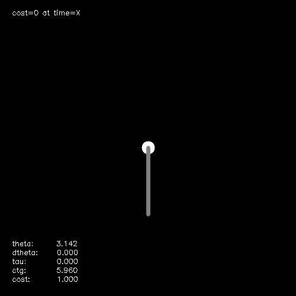
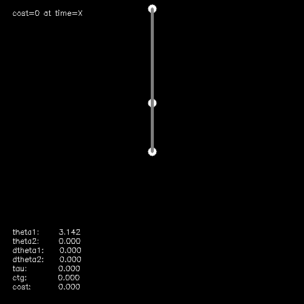
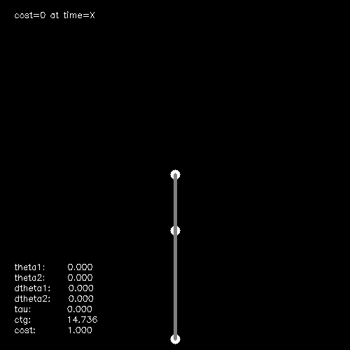
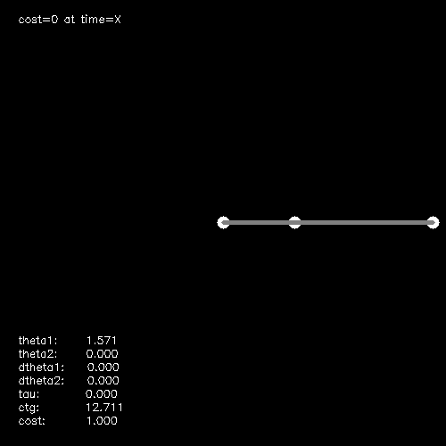
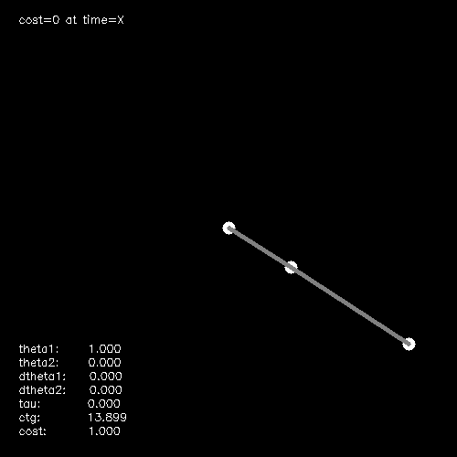

Value Iteration for the Acrobot

This section comprises the experimental results; for the rest of the final report please see the write up.

### Simple Pendulum

Here is a solution for the pendulum swing up problem using a 320 x 320 state space mesh. 

Notice that the cost to go gets stuck around .2, and the pendulum is ever so slightly off center.

Here is a non-uniform geometric mesh at the same resolution, with base exponents 1.1 in both dimensions.

The cost to go now goes to zero and the pendulum appears to be fully upright.

In fact, we actually get a pretty good solution using a 20x20 state space mesh.
In the theta dimension, we have used a base exponent 1.3, which yields a maximum effective resolution of 226.7 around the upright, and a minimum effective resolution of 5.9 around at the bottom. In other words, in order to get the same resolution around the upright with a uniform mesh, you would need 226.7 steps in the theta dimension.
In the dtheta dimension, we have used a base exponent 1.1, which yields a maximum resolution of 85.2 around dtheta=1 and a minimum resolution of 8.0 at the maximum velocities. 
Note that these solutions are clearly not optimal--in particular, it requires pumping many more times than is strictly necessary, but once they approach the upright, it does stabilize.

Finally, we can also visualize the resulting cost-to-gos. Below is the cost-to-go of the uniform 320x320 mesh.

We can compare this with the cost-to-go of the 20x20 geometric mesh. Note that this is plotted on a geometric scale

Qualitatively, the geometric mesh looks to be about the right shape. However the two main differences are 1) the additional resolution around the zero-cost configuration leads to smaller gradients, which intuitively explains why the recovered cost-to-go is able to perform despite having far fewer mesh points, and 2) the cost-to-go does not capture the details of the cost-to-go further away from the zero-cost configuration; however, this does not prevent the resulting controller from (eventually) driving the pendulum to the upright.

### Acrobot

The acrobot tends to fall over even when initialized to the upright

Using a (40x40x40x40) geometric mesh solves this problem

Using an 8x8x320x320 uniform state grid. Surprisingly, this mesh had the best convergence behavior of the HJB update.

Using a 40x40x40x40 geometric state grid. Similar to the pendulum, the controller seems to  require far more ``pumping'' than is necessary before making an attempt to drive the acrobot to the upright.

All the controllers in this section are after tens of thousands of iterations, and take several hours.

